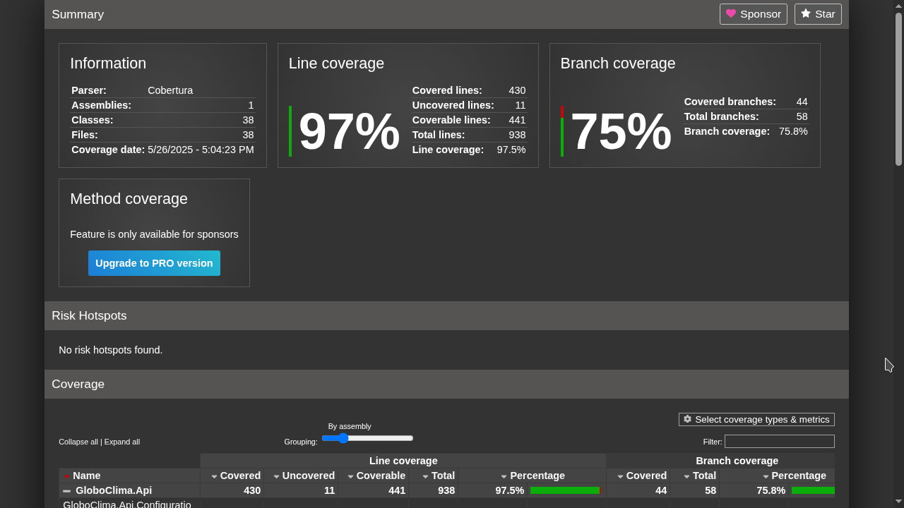
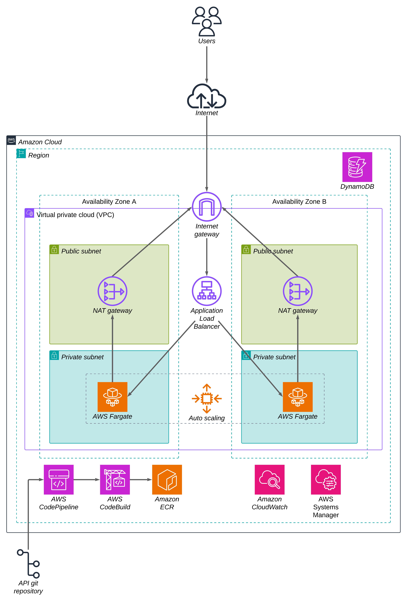
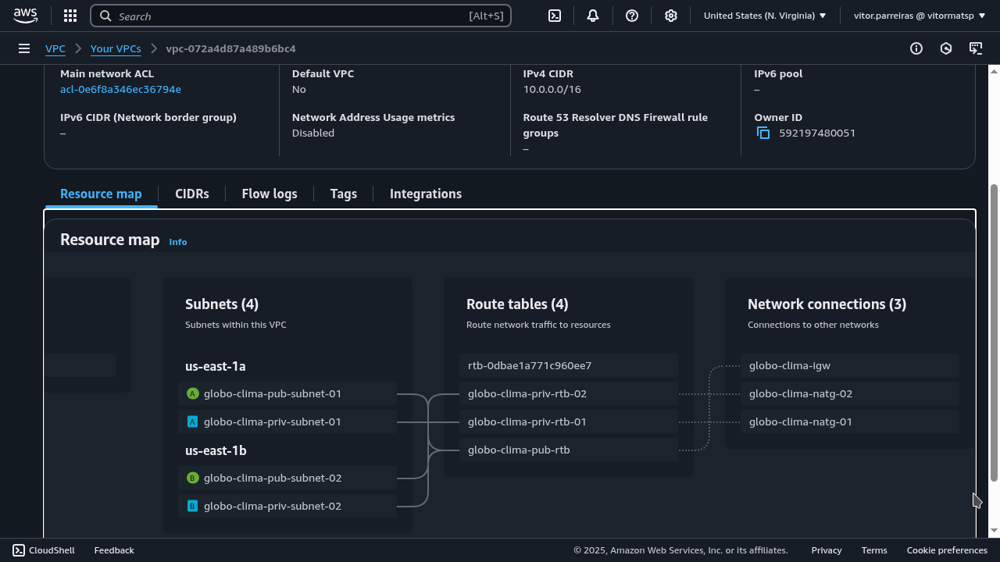
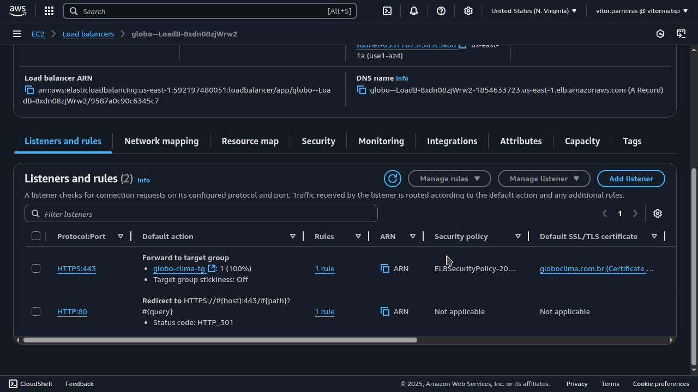
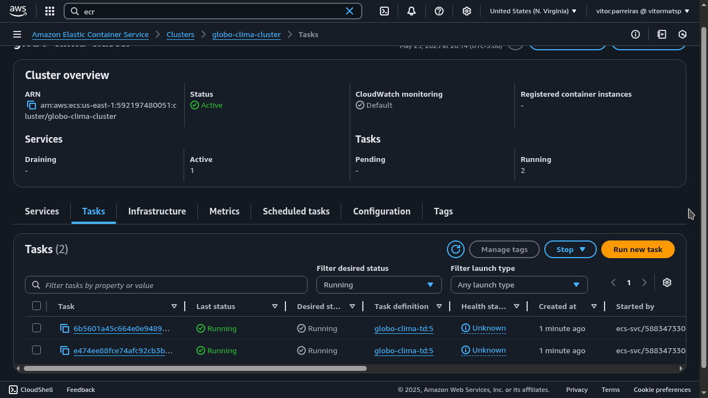
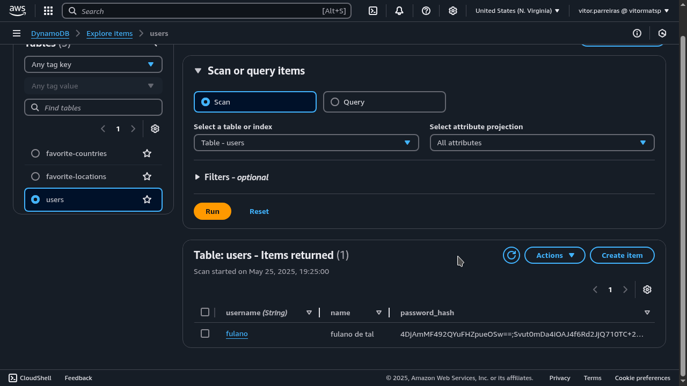
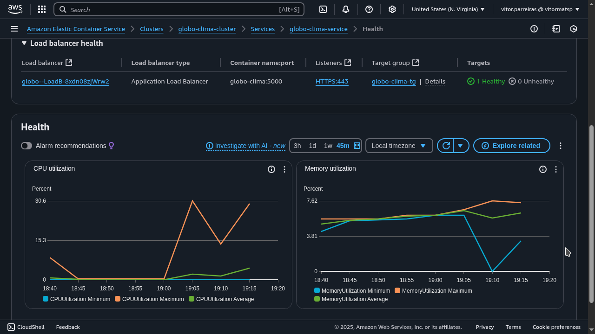
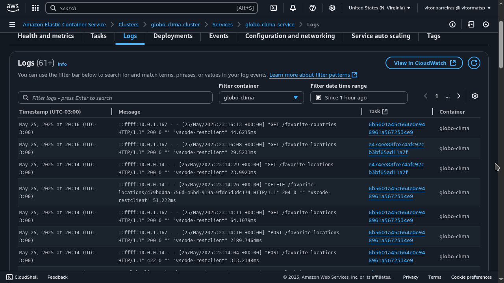
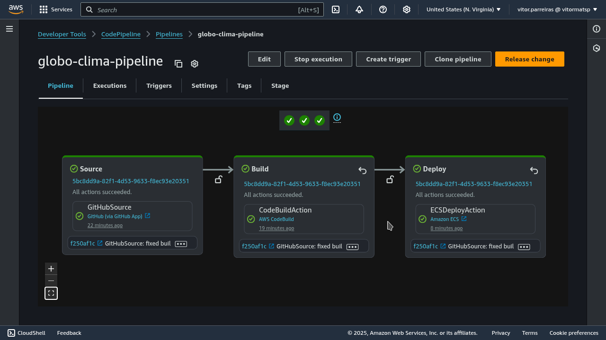
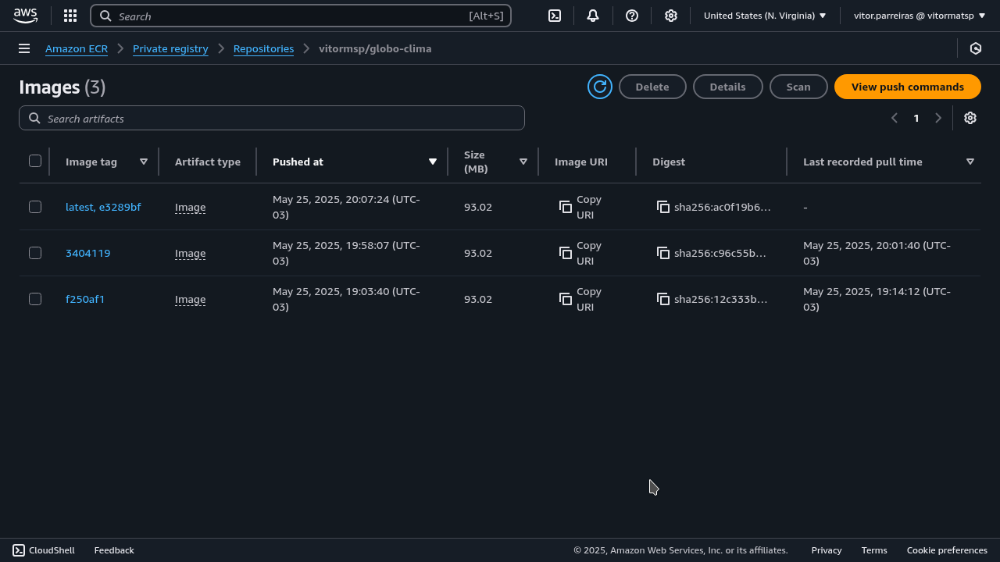

# Globo Clima

Foi desenvolvida uma api para consulta de dados climáticos de um endereço e dados demográficos de um país, com opções de favoritar.
A api foi construída em .Net 8.0, TDD usando xUnit, autenticação com JWT e documentada com Swagger.
A infraestrutura foi implementada na AWS com o CloudFormation, usando o DynamoDB para armazenamento, ALB e ECS para escalabilidade, Code Pipeline para CI/CD e CloudWatch para observabilidade.

### Coverage dos testes na api


### Diagrama da infraestrutura na AWS


### Rede virtual (VPC)


### Load Balancer configurado com HTTPS


### Tasks rodando no ECS para escalabilidade


### Dados armazenados no DynamoDB com senhas criptografadas


### Métricas dos conteiners no CloudWatch


### Logs gerados pela api centralizados no CloudWatch


### Pipeline CI/CD no CodePipeline


### Imagens Docker armazenadas no ECR


## Coverage

Para ver detalhes da cobertura de testes, baixe este repositório e acesse no Browser [este arquivo](assets/coverage/index.html).

## Execução na AWS

Para executar a api na AWS, será necessário fazer fork deste projeto e criar um usuário IAM com permissões de manipulação de dados no DynamoDB. Em seguida, gere sua access key e armazene o id e a secret em parâmetros no Paramter Store. Por fim, crie uma stack no CloudFormation com [este código](api/cloud-formation.yml), preencha os parâmetros solicitados e execute.
Parâmetros:
- ApplicationName: nome que preferir para identificar os recursos da AWS.
- TLSCertificateARN: gere um certificado TLS, cadastre-o no ACM e insira seu ARN neste parâmetro.
- AccessTokenExpiresInSeconds: tempo (em segundos) para expiração do token JWT.
- ApiTokenKeyArn: crie um parâmetro no Paramter Store com a chave do token JWT e insira seu ARN neste parâmetro.
- OpenWeatherMapApiKeyArn: crie um parâmetro no Paramter Store com a api key do OpenWeatherMap e insira seu ARN neste parâmetro.
- DynamoDBAccessKeyIdArn: Insira o ARN do access key id neste parâmetro.
- DynamoDBSecretAccessKeyArn: Insira o ARN da secret access key neste parâmetro.
- GitHubConnectionArn: Crie uma conexão na AWS com o GitHub e insira seu ARN neste parâmetro.
- GitHubRepositoryName: Nome do repositório fork.

## Execução local

Para executar a api localmente, será necessário rodar o container do DynamoDB pelo [Docker Compose](api/docker-compose.yml):

```
docker-compose -f api/docker-compose.yml up -d
```

Para executar os testes, acesse *api/GloboClima.Tests* e rode o comando:
```
dotnet test
```

Para executar a api, acesse *api/GloboClima.Api* e rode os comandos:
```
aws dynamodb create-table \
  --table-name users \
  --attribute-definitions AttributeName=username,AttributeType=S \
  --key-schema AttributeName=username,KeyType=HASH \
  --billing-mode PAY_PER_REQUEST \
  --endpoint-url http://localhost:8000
```

```
aws dynamodb create-table \
  --table-name favorite-countries \
  --attribute-definitions AttributeName=username,AttributeType=S AttributeName=id,AttributeType=S \
  --key-schema AttributeName=username,KeyType=HASH AttributeName=id,KeyType=RANGE \
  --billing-mode PAY_PER_REQUEST \
  --endpoint-url http://localhost:8000
```

```
aws dynamodb create-table \
  --table-name favorite-locations \
  --attribute-definitions AttributeName=username,AttributeType=S AttributeName=id,AttributeType=S \
  --key-schema AttributeName=username,KeyType=HASH AttributeName=id,KeyType=RANGE \
  --billing-mode PAY_PER_REQUEST \
  --endpoint-url http://localhost:8000
```

```
dotnet run
```

## Documentação da API

Para consultar a documentação da api e executar testes manuais, acesse no Browser [este link](http://localhost:5000/swagger).
